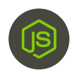

### About Me

Hi there 👋, this is Karthik Bashakarla. I am a software engineer interested in UI Development, Full Stack Web and Mobile App Development. 

## Tech Stack

&emsp;&emsp;&emsp;&emsp;&emsp;&emsp;&emsp;&emsp;&emsp;&emsp;&emsp;&emsp;&emsp;&emsp;&emsp;&emsp;&emsp;&emsp;&emsp;&emsp;&emsp;&emsp;&emsp;&emsp;&emsp;&emsp;&emsp;&emsp;&emsp;&emsp;&emsp;&emsp;&emsp;

### How to reach me: 

  - Email: karthik.bashakarla@gmail.com
  - Linkedin: linkedin.com/in/karthik-bashakarla-10
 
<!--
**Karthik-Bashakarla/Karthik-Bashakarla** is a ✨ _special_ ✨ repository because its `README.md` (this file) appears on your GitHub profile.

Here are some ideas to get you started:

- 🔭 I’m currently working on ...
- 🌱 I’m currently learning ...
- 👯 I’m looking to collaborate on ...
- 🤔 I’m looking for help with ...
- 💬 Ask me about ...
- 📫 How to reach me: ...
- 😄 Pronouns: ...
- ⚡ Fun fact: ...
-->
